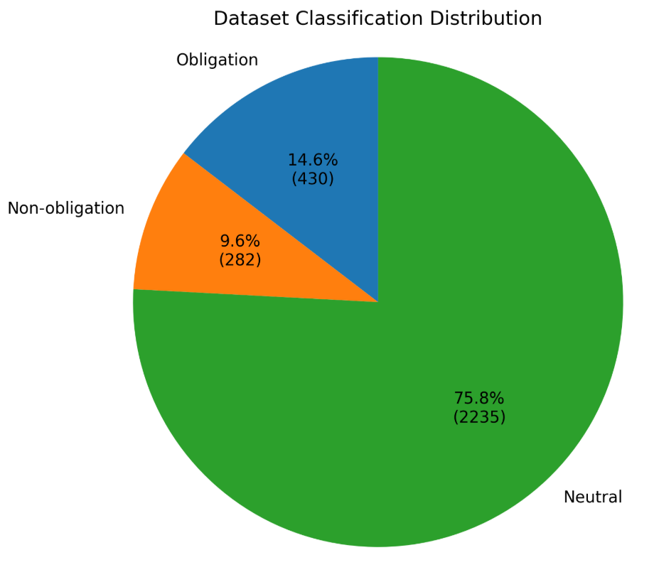
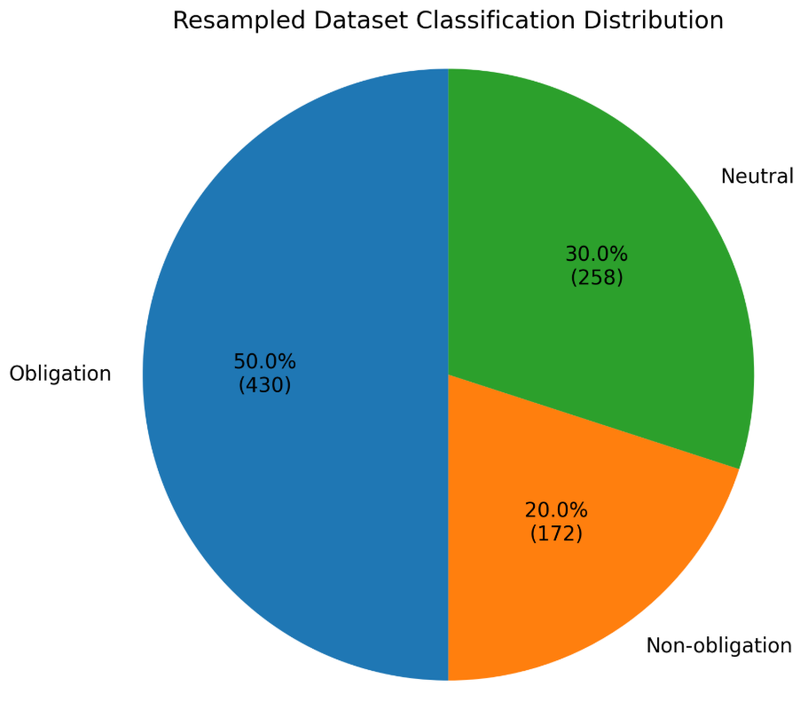

<div align="center">

# ComplianceGPT

### An Open-Source AI Platform for Regulatory Obligation Extraction and Compliance Automation

*The first release of ComplianceGPT introduces a domain-specialized Small Language Model (SLM) fine-tuned on regulatory text to extract structured compliance obligations from legal documents.*

[](https://www.python.org/)
[](https://huggingface.co/docs/transformers)
[](https://github.com/huggingface/peft)
[](https://github.com/unslothai/unsloth)
[](https://mlflow.org/)
[](LICENSE)
[](https://huggingface.co/PrinceRansom7/gemma4-e2b-it-regulatory-obligation-v1)

</div>

---

> **ComplianceGPT** is an open-source Legal AI platform focused on automating regulatory compliance workflows through specialized Small Language Models (SLMs). Rather than relying on a single general-purpose Large Language Model (LLM), ComplianceGPT is designed as a modular ecosystem where task-specific models collaborate to solve different compliance problems with higher efficiency, lower inference cost, and improved domain specialization.

The first public release introduces a **Gemma 4 E2B IT** model fine-tuned specifically for **Regulatory Obligation Extraction**, transforming unstructured legal and regulatory text into structured JSON suitable for downstream Governance, Risk, and Compliance (GRC) systems.

---

# Table of Contents

- [Overview](#overview)
- [Motivation](#motivation)
- [Project Vision](#project-vision)
- [Current Release](#current-release)
- [Key Features](#key-features)
- [Repository Structure](#repository-structure)
- [Quick Start](#quick-start)
- [Project Workflow](#project-workflow)

---

# Overview

Regulatory documents contain thousands of statements that vary in purpose. Some statements impose legal obligations, while others provide recommendations, explanatory information, definitions, or contextual guidance.

Traditional language models are capable of reading these documents, but they are not optimized for extracting compliance obligations in a structured format that can be consumed by downstream applications.

ComplianceGPT addresses this challenge by combining domain-specific instruction tuning with parameter-efficient fine-tuning to create specialized models capable of understanding regulatory language and converting it into structured machine-readable outputs.

The first release focuses on identifying regulatory obligations and extracting key compliance entities such as:

- Subject
- Required action
- Modality
- Conditions
- Deadlines
- Supporting metadata

The resulting structured outputs can be integrated into compliance monitoring systems, Retrieval-Augmented Generation (RAG) pipelines, knowledge graphs, and regulatory intelligence platforms.

---

# Motivation

Regulatory compliance is a knowledge-intensive task that requires organizations to continuously interpret large volumes of legal documents, standards, and regulatory updates.

Examples include:

- RBI Guidelines
- MAS Regulations

These documents contain a mixture of:

- Mandatory obligations
- Recommendations
- Informational statements
- Definitions
- Exceptions
- References

In real-world compliance workflows, organizations are primarily interested in identifying actionable obligations.

However, regulatory corpora are naturally imbalanced, with informative and neutral statements significantly outnumbering mandatory obligations. This imbalance makes it difficult for general-purpose models to consistently identify obligation statements without additional domain adaptation.

ComplianceGPT was developed to address this problem by building specialized models that prioritize regulatory obligation understanding while preserving contextual reasoning over legal text.

---

# Project Vision

ComplianceGPT is not intended to be a single language model.

It is envisioned as a modular compliance intelligence platform composed of multiple task-specific Small Language Models (SLMs), where each model specializes in a particular stage of the compliance lifecycle.

Future versions will integrate:

- Regulatory Obligation Extraction
- Regulatory Entity Recognition
- Compliance Question Answering
- Regulatory Summarization
- Knowledge Graph Generation
- Graph Retrieval-Augmented Generation (GraphRAG)
- Regulatory Change Detection
- Cross-document Compliance Reasoning
- Policy-to-Regulation Mapping

Instead of relying on one monolithic LLM, ComplianceGPT adopts a multi-model architecture in which specialized components collaborate to solve complex compliance tasks efficiently.

---

# Current Release

The first public model available in this repository is:

## Gemma 4 E2B IT – Regulatory Obligation Extraction v1

This model has been instruction-tuned using QLoRA to extract structured regulatory obligations from legal and compliance documents.

The model classifies text into three categories:

| Class | Description |
|--------|-------------|
| Obligation | Mandatory regulatory requirement requiring action |
| Non-obligation | Statements that do not impose mandatory actions |
| Neutral | Informational or descriptive regulatory statements |

For obligation statements, the model generates structured JSON suitable for downstream automation pipelines.

The released model is available on Hugging Face:

**https://huggingface.co/PrinceRansom7/gemma4-e2b-it-regulatory-obligation-v1**

---

# Key Features

## Domain-Specific Fine-Tuning

Instead of generic instruction tuning, the model has been trained specifically for regulatory obligation extraction using carefully curated compliance data.

---

## Parameter-Efficient Training

The model was fine-tuned using:

- QLoRA
- LoRA adapters
- 4-bit NF4 quantization
- PEFT
- Unsloth

This significantly reduces GPU memory requirements while maintaining competitive performance.

---

## Structured JSON Generation

Instead of producing free-form text, ComplianceGPT generates structured outputs suitable for machine processing.

Example:

```json
{
  "output": [
    {
      "subject": "Financial Institution",
      "action": "Maintain customer records",
      "modality": "MUST",
      "conditions": "",
      "deadline": "Five years"
    }
  ]
}
```

---

## Designed for Compliance Automation

The generated outputs are suitable for:

- Governance, Risk and Compliance (GRC)
- Regulatory monitoring
- Compliance dashboards
- Rule engines
- Knowledge Graph construction
- Retrieval-Augmented Generation (RAG)
- Internal compliance assistants

---

## Experiment Tracking

The complete fine-tuning workflow is tracked using MLflow.

Tracked information includes:

- Hyperparameters
- Training configuration
- Dataset versions
- Model artifacts
- Evaluation metrics
- Experiment history

This improves reproducibility and simplifies future experimentation.

---

# Repository Structure

```text
ComplianceGPT/

├── README.md
├── docs/
├── data/
├── notebooks/
├── src/
├── configs/
├── benchmarks/
├── images/
├── scripts/
├── LICENSE
├── CHANGELOG.md
├── CONTRIBUTING.md
├── CODE_OF_CONDUCT.md
├── SECURITY.md
└── CITATION.cff
```

The repository is organized to separate project documentation, datasets, notebooks, source code, configurations, benchmarks, and deployment resources, making it easier to reproduce experiments and extend the project.

---

# Quick Start

## Clone the repository

```bash
git clone https://github.com/Comply2Reg/ComplianceGPT.git

cd ComplianceGPT
```

## Install dependencies

```bash
pip install -r requirements.txt
```

## Load the published model

```python
from transformers import AutoTokenizer, AutoModelForCausalLM

model_id = "PrinceRansom7/gemma4-e2b-it-regulatory-obligation-v1"

tokenizer = AutoTokenizer.from_pretrained(model_id)

model = AutoModelForCausalLM.from_pretrained(
    model_id,
    device_map="auto"
)
```

Additional examples for inference, evaluation, and fine-tuning are provided in the `docs/` directory and accompanying notebooks.

---

# Project Workflow

The current implementation follows the workflow illustrated below.

```text
Regulatory Documents
        │
        ▼
Document Parsing
        │
        ▼
Instruction Dataset Creation
        │
        ▼
Dataset Validation
        │
        ▼
Class Distribution Analysis
        │
        ▼
Dataset Resampling
        │
        ▼
QLoRA Fine-Tuning
        │
        ▼
Evaluation
        │
        ├────────► MLflow Tracking
        │
        ▼
Model Export
        │
        ▼
Hugging Face Deployment
        │
        ▼
Compliance Applications
```

The following sections describe each stage of this workflow in detail, including dataset engineering, prompt design, model configuration, evaluation methodology, and deployment.

---

# Dataset Engineering

The performance of a domain-specific language model is heavily influenced by the quality, structure, and distribution of its training data. Rather than relying on generic instruction datasets, ComplianceGPT was trained using a custom instruction dataset specifically designed for regulatory obligation extraction.

The dataset was constructed to teach the model not only to recognize mandatory regulatory obligations but also to distinguish them from descriptive and non-actionable regulatory text. This distinction is critical for compliance automation, where downstream systems require structured representations of actionable requirements instead of free-form summaries.

The training pipeline consisted of four major stages:

1. Regulatory document collection
2. Instruction dataset creation
3. Dataset validation and quality checks
4. Dataset resampling for domain-focused learning

---

# Regulatory Sources

The instruction dataset was created from publicly available regulatory standards and compliance frameworks spanning multiple industries.

Representative sources include:

| Regulation / Standard | Domain |
|------------------------|--------|
| RBI Guidelines | Banking |
| MAS Regulations | Financial Services |


These sources contain a mixture of mandatory obligations, recommendations, informative guidance, definitions, and references. The objective of the training process was to enable the model to distinguish actionable compliance requirements from surrounding contextual information.

---

# Dataset Construction Pipeline

The overall data preparation workflow is illustrated below.

```text
Regulatory Documents
        │
        ▼
Document Parsing
        │
        ▼
Chunk Generation
        │
        ▼
Manual Validation
        │
        ▼
Instruction Generation
        │
        ▼
JSONL Dataset
        │
        ▼
Distribution Analysis
        │
        ▼
Dataset Resampling
        │
        ▼
Final Training Dataset
```

Each stage contributes to improving the quality, consistency, and suitability of the training corpus for supervised instruction tuning.

---

# Dataset Annotation Strategy

Each regulatory text segment was categorized into one of three semantic classes based on its regulatory intent.

| Class | Description |
|--------|-------------|
| **Obligation** | Statements that impose mandatory actions or compliance requirements. |
| **Non-Obligation** | Statements that do not impose enforceable actions, such as recommendations or explanatory text. |
| **Neutral** | Informational, descriptive, or contextual statements without actionable requirements. |

This classification enables the model to learn not only what constitutes an obligation but also what should **not** be interpreted as one.

---

# Original Dataset Distribution

Following document parsing and validation, the original dataset contained **2,947** instruction samples.

| Class | Samples | Percentage |
|--------|---------|-----------:|
| Obligation | 430 | 14.59% |
| Non-Obligation | 282 | 9.57% |
| Neutral | 2,235 | 75.84% |
| **Total** | **2,947** | **100%** |

The distribution reveals a substantial class imbalance. Nearly three-quarters of the dataset consisted of neutral statements, while obligation examples represented less than 15% of the corpus.

This imbalance accurately reflects the structure of real-world regulatory documents, where descriptive and explanatory text significantly outnumbers mandatory compliance requirements.

> **Figure 1. Original Dataset Distribution**

Place the original distribution chart in:

```text
images/original_distribution.png
```

Then display it in the README:

```markdown
<p align="center">

</p>
```

---

# Why Resampling Was Necessary

Although the original dataset accurately represented real regulatory documents, directly training on this distribution would encourage the model to favor predicting neutral statements due to their overwhelming frequency.

However, the primary objective of ComplianceGPT is **regulatory obligation extraction**, not document summarization.

To better align the optimization objective with the intended downstream task, the dataset was intentionally resampled to increase the proportion of obligation examples while preserving representative examples from the remaining classes.

This approach encourages the model to:

- Improve recall for obligation statements.
- Reduce bias toward neutral classifications.
- Learn richer obligation patterns.
- Produce higher-quality structured outputs for compliance workflows.

Rather than mirroring the natural distribution of regulatory documents, the resampled dataset reflects the practical priorities of compliance automation systems.

---

# Resampled Training Dataset

After resampling, the final instruction dataset contained **860** high-quality training examples.

| Class | Samples | Percentage |
|--------|---------|-----------:|
| Obligation | 430 | 50% |
| Neutral | 258 | 30% |
| Non-Obligation | 172 | 20% |
| **Total** | **860** | **100%** |

This resampling strategy preserves all obligation examples while reducing the number of neutral and non-obligation samples to create a more balanced learning signal.

> **Figure 2. Resampled Dataset Distribution**

Place the resampled distribution chart in:

```text
images/resampled_distribution.png
```

Then display it using:

```markdown
<p align="center">

</p>
```

---

# Training Data Format

The final dataset was stored in JSON Lines (`.jsonl`) format, where each line represents an independent instruction-response pair suitable for supervised fine-tuning.

Each sample follows an instruction-tuning paradigm consisting of:

- System Prompt
- User Instruction
- Assistant Response

This structure enables compatibility with modern chat-based language models and instruction-tuning frameworks.

A simplified representation is shown below.

```json
{
  "messages": [
    {
      "role": "system",
      "content": "You are a legal NLP expert..."
    },
    {
      "role": "user",
      "content": "Every financial institution shall maintain customer records for five years."
    },
    {
      "role": "assistant",
      "content": {
        "classification": "obligation",
        "output": [
          {
            "subject": "Financial Institution",
            "action": "Maintain customer records",
            "modality": "MUST",
            "deadline": "Five years"
          }
        ]
      }
    }
  ]
}
```

---

# Prompt Engineering

A carefully designed system prompt was used throughout fine-tuning to ensure consistent behavior across all training examples.

The prompt instructs the model to:

- Identify whether a regulatory statement contains an obligation.
- Distinguish obligations from informational and non-obligatory text.
- Produce valid structured JSON.
- Follow a predefined output schema.
- Avoid generating unnecessary explanations outside the expected format.

This instruction-based approach improves consistency during both training and inference while reducing output variability.

---

# Output Schema

For obligation statements, the model extracts structured compliance entities including:

| Field | Description |
|--------|-------------|
| Subject | Entity responsible for performing the action |
| Action | Required regulatory action |
| Modality | Regulatory strength (e.g., MUST, SHALL) |
| Conditions | Conditional requirements, if present |
| Deadline | Time-based obligations, if specified |

This structured representation enables straightforward integration with downstream compliance systems, rule engines, dashboards, and knowledge graphs.

---

# Data Quality Assurance

Multiple quality assurance steps were performed during dataset preparation to improve consistency and reduce annotation noise.

These included:

- Removal of invalid records.
- Validation of JSON structure.
- Consistent instruction formatting.
- Standardized output schema.
- Verification of class labels.
- Manual inspection of representative samples.

These quality checks help improve the reliability of the training data and contribute to more stable model behavior during fine-tuning.

---

# Dataset Summary

| Property | Value |
|-----------|-------|
| Original Samples | 2,947 |
| Final Training Samples | 860 |
| Number of Classes | 3 |
| Training Format | JSONL |
| Fine-Tuning Style | Instruction Tuning |
| Output Format | Structured JSON |
| Primary Task | Regulatory Obligation Extraction |
| Secondary Task | Obligation Classification |

The resulting instruction dataset forms the foundation of ComplianceGPT's first specialized SLM for regulatory obligation extraction and provides a balanced, domain-focused corpus for efficient parameter-efficient fine-tuning.

---

# Model Architecture

The first release of ComplianceGPT is built upon **Google's Gemma 4 E2B IT**, an instruction-tuned Small Language Model (SLM) designed for efficient text generation and downstream adaptation.

Rather than training a model from scratch, this project adopts a **parameter-efficient fine-tuning (PEFT)** approach to specialize the base model for regulatory obligation extraction. This significantly reduces computational requirements while preserving the language understanding capabilities learned during pretraining.

The fine-tuned model is publicly available on Hugging Face:

> **Model Repository**  
> https://huggingface.co/PrinceRansom7/gemma4-e2b-it-regulatory-obligation-v1

---

# Why Gemma 4?

Selecting an appropriate base model is an important design decision for domain adaptation.

Gemma 4 E2B IT was selected because it provides:

- Strong instruction-following capabilities.
- High-quality reasoning over structured text.
- Efficient parameter-efficient fine-tuning using LoRA.
- Compatibility with modern open-source tooling.
- Low-memory inference when combined with quantization.
- Excellent integration with Hugging Face Transformers and Unsloth.

For compliance applications, these characteristics enable the creation of specialized models without requiring the computational resources typically associated with large-scale LLM training.

---

# Fine-Tuning Strategy

ComplianceGPT uses **QLoRA (Quantized Low-Rank Adaptation)** to specialize the base model.

Instead of updating every parameter in the neural network, QLoRA freezes the original model weights and learns only a small number of trainable adapter parameters.

This approach offers several advantages:

- Significantly lower GPU memory consumption.
- Faster training.
- Smaller checkpoints.
- Easy deployment using PEFT adapters.
- Minimal degradation compared to full fine-tuning.

The original pretrained knowledge remains intact while the adapters learn regulatory-domain behavior.

---

# Parameter-Efficient Fine-Tuning (PEFT)

The project uses the Hugging Face **PEFT** library together with Unsloth.

The overall training process consists of:

```text
Gemma 4 Base Model
        │
        ▼
Freeze Base Parameters
        │
        ▼
Attach LoRA Adapters
        │
        ▼
Train Only Adapter Weights
        │
        ▼
Merge (Optional)
        │
        ▼
Inference
```

Only a very small fraction of the model parameters are updated during training, making experimentation substantially more efficient.

---

# Quantization

To reduce memory usage during training, the base model was loaded using **4-bit NF4 quantization**.

Benefits include:

- Reduced GPU memory requirements.
- Faster loading.
- Lower storage footprint.
- Efficient Colab training.
- Support for larger context windows within limited hardware.

The combination of quantization and LoRA enables high-quality fine-tuning on commodity GPUs.

---

# Training Configuration

The following configuration was used during fine-tuning.

| Parameter | Value |
|-----------|------:|
| Base Model | Google Gemma 4 E2B IT |
| Fine-Tuning Method | QLoRA |
| Quantization | 4-bit NF4 |
| Context Length | 1024 |
| LoRA Rank (r) | 16 |
| LoRA Alpha | 16 |
| LoRA Dropout | 0.05 |
| Learning Rate | 1e-4 |
| Optimizer | AdamW 8-bit |
| Learning Rate Scheduler | Cosine |
| Epochs | 5 |
| Batch Size | 1 |
| Gradient Accumulation | 4 |
| Mixed Precision | FP16 |
| Gradient Checkpointing | Unsloth |

This configuration was selected to balance training efficiency, GPU memory usage, and downstream task performance.

---

# LoRA Configuration

Low-Rank Adaptation introduces trainable matrices into selected transformer layers while leaving the original weights unchanged.

The primary LoRA parameters used in this project are summarized below.

| Parameter | Value |
|-----------|------:|
| Rank (r) | 16 |
| Alpha | 16 |
| Dropout | 0.05 |
| Bias | None |
| Fine-Tuning Style | Instruction Tuning |

These values provide a good balance between model capacity and computational efficiency for domain-specific adaptation.

---

# Training Environment

The model was fine-tuned using a cloud-based GPU environment with modern open-source tooling.

| Component | Value |
|-----------|-------|
| Development Environment | Google Colab |
| GPU | NVIDIA Tesla T4 (16 GB) |
| Framework | Unsloth |
| Transformers | Hugging Face Transformers |
| Adapter Library | PEFT |
| Training Library | TRL |
| Quantization | BitsAndBytes |
| Experiment Tracking | MLflow |

The use of Unsloth significantly reduced memory overhead and accelerated training compared to conventional QLoRA implementations.

---

# Training Workflow

The end-to-end fine-tuning workflow is summarized below.

```text
Instruction Dataset
        │
        ▼
Tokenization
        │
        ▼
Gemma 4 E2B IT
        │
        ▼
Load in 4-bit
        │
        ▼
Attach LoRA Adapters
        │
        ▼
QLoRA Fine-Tuning
        │
        ▼
Checkpoint Saving
        │
        ▼
Evaluation
        │
        ▼
MLflow Logging
        │
        ▼
Model Export
        │
        ▼
Hugging Face
```

This workflow emphasizes reproducibility by combining structured data preparation, parameter-efficient fine-tuning, experiment tracking, and version-controlled model publishing.

---

# Experiment Tracking with MLflow

To improve reproducibility and simplify experimentation, all training runs were tracked using **MLflow**.

The experiment tracking pipeline records:

- Hyperparameters
- Training configuration
- Learning rate
- Optimizer settings
- LoRA configuration
- Model checkpoints
- Evaluation metrics
- Artifacts

Using MLflow makes it possible to compare different experiments, reproduce previous runs, and maintain a complete training history.

> **Suggested Figure:** MLflow Dashboard

Save the screenshot as:

```text
images/mlflow_dashboard.png
```

Display it using:

```markdown
<p align="center">

</p>
```

---

# Memory Optimization

A key objective of this project was to demonstrate that specialized compliance models can be trained efficiently without requiring high-end hardware.

Several optimization techniques were employed during training:

- 4-bit NF4 quantization.
- QLoRA adapters.
- Gradient checkpointing.
- FP16 mixed precision.
- 8-bit optimizer.
- Parameter-efficient fine-tuning.

Together, these techniques significantly reduced memory consumption while maintaining strong adaptation performance.

---

# Model Export

After training, the LoRA adapters were exported for inference and deployment.

The resulting model can be:

- Loaded directly using PEFT adapters.
- Merged with the base model for standalone deployment.
- Uploaded to Hugging Face.
- Used with Hugging Face Transformers.
- Integrated into downstream compliance applications.

---

# Hugging Face Deployment

The trained model has been published on Hugging Face to support reproducible research and public experimentation.

Repository:

> https://huggingface.co/PrinceRansom7/gemma4-e2b-it-regulatory-obligation-v1

The repository includes:

- Model weights
- Tokenizer
- Configuration files
- Model card
- Usage examples

Researchers and developers can directly load the model using the Hugging Face Transformers library.

Example:

```python
from transformers import AutoTokenizer, AutoModelForCausalLM

model_id = "PrinceRansom7/gemma4-e2b-it-regulatory-obligation-v1"

tokenizer = AutoTokenizer.from_pretrained(model_id)

model = AutoModelForCausalLM.from_pretrained(
    model_id,
    device_map="auto"
)
```

---

# Reproducibility

To facilitate reproducibility, this repository provides:

- Training notebooks.
- Configuration files.
- Sample datasets.
- Documentation.
- Hyperparameter settings.
- Prompt templates.
- Model checkpoints.
- Experiment tracking information.

The goal is to enable other researchers and practitioners to reproduce the fine-tuning process or extend the project for additional compliance-related tasks.

---

# Summary

The first ComplianceGPT model demonstrates how parameter-efficient fine-tuning can transform a general-purpose instruction-tuned language model into a domain-specialized regulatory assistant.

By combining **Gemma 4**, **QLoRA**, **Unsloth**, **PEFT**, and **MLflow**, the project establishes a reproducible pipeline for building efficient Legal AI systems capable of extracting structured regulatory obligations while remaining practical to train and deploy on modest hardware.

---

# Evaluation Methodology

The primary objective of ComplianceGPT is to accurately identify regulatory obligations and convert them into structured machine-readable representations suitable for downstream compliance applications.

Unlike traditional text generation tasks, evaluation focuses on both **classification correctness** and **information extraction quality**.

The evaluation pipeline was designed to measure:

- Correct identification of obligation statements.
- Accurate extraction of structured obligation entities.
- Correct prediction of regulatory modality.
- Consistency of generated JSON.
- Robustness across multiple regulatory domains.

---

# Evaluation Metrics

The following metrics were used during model evaluation.

| Metric | Description |
|----------|-------------|
| Span Precision | Measures the correctness of extracted obligation spans. |
| Span Recall | Measures the completeness of extracted obligation spans. |
| Span F1 Score | Harmonic mean of precision and recall. |
| Modality Accuracy | Accuracy of predicted regulatory modality (e.g., SHALL, MUST). |
| JSON Validity | Percentage of syntactically valid JSON outputs. |

Together, these metrics provide a comprehensive assessment of both extraction accuracy and output usability.

---

# Benchmarking Strategy

Rather than relying solely on traditional language-model benchmarks, ComplianceGPT emphasizes **task-specific evaluation** for regulatory obligation extraction.

The benchmarking workflow consists of:

```text
Fine-tuned Model
        │
        ▼
Golden Test Dataset
        │
        ▼
Prediction Generation
        │
        ▼
JSON Validation
        │
        ▼
Entity Matching
        │
        ▼
Metric Computation
        │
        ▼
Performance Report
```

The evaluation framework has been designed to support additional benchmark datasets and future model comparisons as the project evolves.

---

# Example Inference

Example regulatory statement:

```text
Every financial institution shall maintain customer records for five years.
```

Expected structured output:

```json
{
  "classification": "obligation",
  "output": [
    {
      "subject": "Financial Institution",
      "action": "Maintain customer records",
      "modality": "MUST",
      "conditions": "",
      "deadline": "Five years"
    }
  ]
}
```

The structured output is intentionally designed for integration with downstream compliance systems rather than conversational interaction.

---

# Installation

Clone the repository:

```bash
git clone https://github.com/Comply2Reg/ComplianceGPT.git

cd ComplianceGPT
```

Install dependencies:

```bash
pip install -r requirements.txt
```

Alternatively, create a dedicated environment:

```bash
conda env create -f environment.yml

conda activate compliancegpt
```

---

# Running Inference

Load the published model from Hugging Face.

```python
from transformers import AutoTokenizer
from transformers import AutoModelForCausalLM

model_id = "PrinceRansom7/gemma4-e2b-it-regulatory-obligation-v1"

tokenizer = AutoTokenizer.from_pretrained(model_id)

model = AutoModelForCausalLM.from_pretrained(
    model_id,
    device_map="auto"
)

prompt = """
Every financial institution shall maintain customer records for five years.
"""

inputs = tokenizer(prompt, return_tensors="pt")

outputs = model.generate(
    **inputs,
    max_new_tokens=256,
    temperature=0.1
)

print(tokenizer.decode(outputs[0], skip_special_tokens=True))
```

More detailed inference examples are provided in the accompanying notebooks.

---

# Repository Documentation

Detailed technical documentation is available within the `docs/` directory.

| Document | Description |
|-----------|-------------|
| architecture.md | System architecture and design decisions. |
| dataset.md | Dataset creation and annotation process. |
| preprocessing.md | Data preprocessing pipeline. |
| prompt_design.md | Prompt engineering methodology. |
| model.md | Model architecture and PEFT configuration. |
| training.md | Fine-tuning workflow and hyperparameters. |
| evaluation.md | Evaluation methodology and metrics. |
| benchmarking.md | Benchmark design and comparison strategy. |
| mlflow.md | Experiment tracking using MLflow. |
| inference.md | Inference workflow and deployment examples. |
| deployment.md | Hugging Face deployment process. |
| roadmap.md | Project roadmap and planned features. |

---

# Applications

ComplianceGPT is intended for research and engineering applications including:

- Regulatory obligation extraction
- Governance, Risk and Compliance (GRC)
- Regulatory document understanding
- Internal compliance assistants
- Retrieval-Augmented Generation (RAG)
- Regulatory knowledge graph construction
- Compliance dashboards
- Regulatory monitoring systems
- AI-assisted policy analysis

The project is designed to serve as a building block for larger compliance intelligence platforms.

---

# Current Limitations

The current release represents the first specialized model within the ComplianceGPT project.

Known limitations include:

- Focused on English-language regulatory documents.
- Optimized specifically for obligation extraction.
- Performance may decrease on unseen regulatory writing styles.
- Long documents require preprocessing and chunking.
- Outputs should always be reviewed by qualified compliance or legal professionals before use in production.

These limitations inform the future development roadmap.

---

# Project Roadmap

ComplianceGPT is intended to evolve into a modular compliance AI platform composed of multiple specialized models working together.

## Completed

- Instruction dataset creation.
- Domain-specific prompt engineering.
- Dataset validation.
- Dataset resampling.
- QLoRA fine-tuning.
- Structured JSON generation.
- MLflow experiment tracking.
- Hugging Face model publication.
- Comprehensive project documentation.

## Planned

- Expanded evaluation across additional regulatory frameworks.
- Improved extraction of conditional and nested obligations.
- Support for multilingual regulatory documents.
- Larger and more diverse training corpus.
- Additional benchmark datasets.
- Interactive inference interface.
- Model quantization for optimized deployment.
- Automated evaluation pipeline.

## Long-Term Vision

The broader ComplianceGPT platform is envisioned as a collection of specialized AI components supporting end-to-end compliance workflows.

Planned capabilities include:

- Regulatory Entity Recognition
- Regulatory Obligation Extraction
- Regulatory Classification
- Compliance Question Answering
- Regulatory Summarization
- Regulatory Change Detection
- Policy-to-Regulation Mapping
- Knowledge Graph Generation
- Vector Database Integration
- Graph Database Integration
- GraphRAG for compliance retrieval
- Multi-SLM orchestration
- Explainable compliance reasoning

Rather than relying on a single monolithic language model, the long-term objective is to build a modular ecosystem where each task is handled by a domain-specialized model.

---

# Contributing

Contributions are welcome.

Potential contribution areas include:

- Additional regulatory datasets.
- New evaluation benchmarks.
- Documentation improvements.
- Bug reports.
- Model optimization.
- Deployment examples.
- Regulatory domain extensions.

Please refer to **CONTRIBUTING.md** for contribution guidelines.

---

# Citation

If you use ComplianceGPT in your research, please cite:

```bibtex
@misc{ComplianceGPT2026,
  title={ComplianceGPT: Regulatory Obligation Extraction using Parameter-Efficient Fine-Tuning of Gemma 4},
  author={Prince Ransom},
  year={2026},
  howpublished={GitHub Repository},
  url={https://github.com/Comply2Reg/ComplianceGPT}
}
```

If you use the released model directly, please also cite the Hugging Face model repository.

---

# License

This project is licensed under the **Apache License 2.0**.

See the `LICENSE` file for additional details.

---

# Acknowledgements

This project was made possible through the open-source AI ecosystem.

Special thanks to the communities and organizations behind:

- Google Gemma
- Hugging Face
- Transformers
- PEFT
- Unsloth
- TRL
- BitsAndBytes
- MLflow

The project also builds upon publicly available regulatory standards and documentation used exclusively for research and educational purposes.

---

# Contact

For questions, suggestions, or collaboration opportunities:

- **GitHub:** https://github.com/Comply2Reg/ComplianceGPT
- **Hugging Face:** https://huggingface.co/PrinceRansom7/gemma4-e2b-it-regulatory-obligation-v1

---

<div align="center">

### ComplianceGPT

**Building domain-specialized AI systems for intelligent regulatory compliance.**

*Current Release: Gemma 4 E2B IT – Regulatory Obligation Extraction v1*

</div>